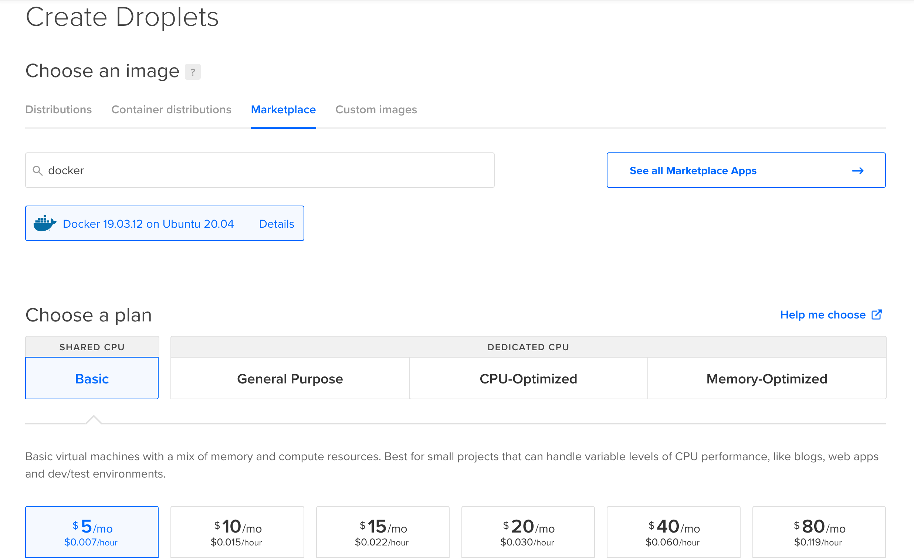
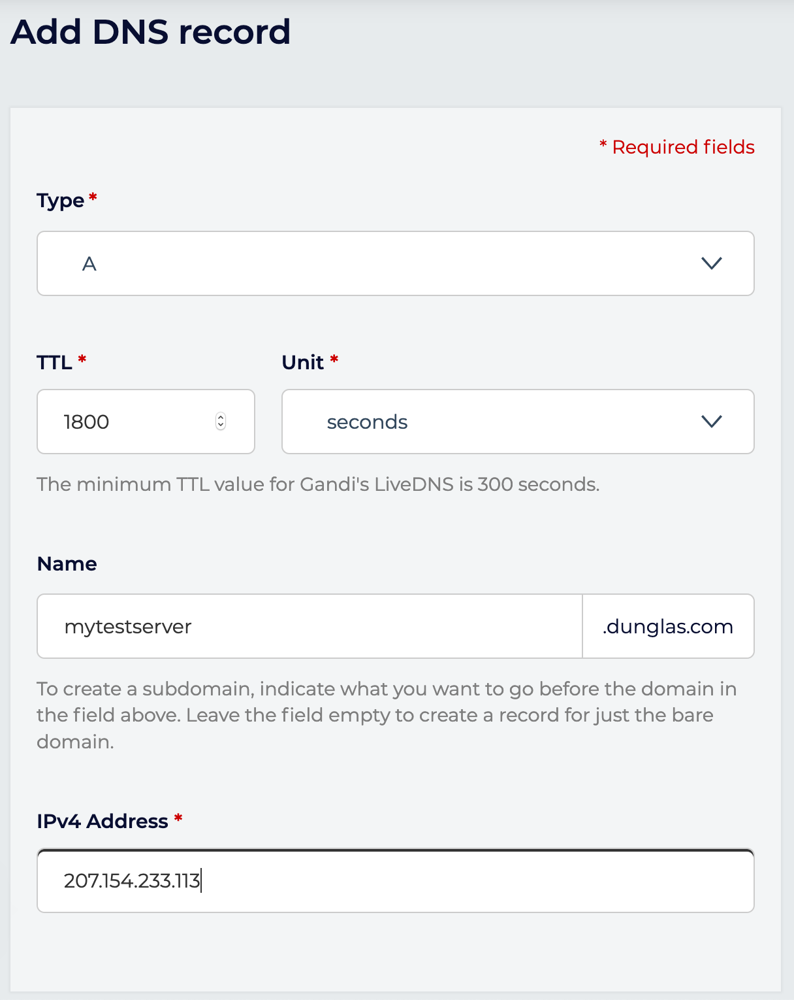

# Deploying in Production

Symfony Docker provides Docker images, and a Docker Compose definition optimized for production usage.
In this tutorial, we will learn how to deploy our Symfony application on a single server using Docker Compose.

## Preparing a Server

To deploy your application in production, you need a server.
In this tutorial we will use a virtual machine provided by DigitalOcean, but any Linux server can work.
If you already have a Linux server with Docker Compose installed, you can skip straight to [the next section](#configuring-a-domain-name).

Otherwise, use [this affiliate link](https://m.do.co/c/5d8aabe3ab80) to get $100 of free credit, create an account, then click on "Create a Droplet".
Then, click on the "Marketplace" tab under the "Choose an image" section and search for the app named "Docker".
This will provision an Ubuntu server with the latest versions of Docker and Docker Compose already installed!

To test, the cheapest plan will be enough, but for real production usage you'll probably want to pick a plan in the "general purpose" section that will fit your needs.



You can keep the defaults for other settings, or tweak them according to your needs.
Don't forget to add your SSH key or to create a password then press the "Finalize and create" button.

Then, wait a few seconds while your Droplet is provisioning.
When your Droplet is ready, use SSH to connect:

```console
ssh root@<droplet-ip>
```

## Configuring a Domain Name

In most cases, you'll want to associate a domain name to your website.
If you don't own a domain name yet, you'll have to buy one through a registrar.
Use [this affiliate link](https://gandi.link/f/93650337) to redeem a 20% discount at Gandi.net.

Then create a DNS record of type `A` for your domain name pointing to the IP address of your server.

Example:

```dns
your-domain-name.example.com.  IN  A     207.154.233.113
````

Example in Gandi's UI:



Note: Let's Encrypt, the service used by default by Symfony Docker to automatically generate a TLS certificate doesn't support using bare IP addresses.
Using a domain name is mandatory to use Let's Encrypt.

## Deploying

Copy your project on the server using `git clone`, `scp` or any other tool that may fit your need.
If you use GitHub, you may want to use [a deploy key](https://docs.github.com/en/free-pro-team@latest/developers/overview/managing-deploy-keys#deploy-keys).
Deploy keys are also [supported by GitLab](https://docs.gitlab.com/ee/user/project/deploy_keys/). 

Example with Git:

```console
git clone git@github.com:<username>/<project-name>.git
```

Go into the directory containing your project (`<project-name>`), and start the app in production mode:

```console
SERVER_NAME=your-domain-name.example.com \
APP_SECRET=ChangeMe \
CADDY_MERCURE_JWT_SECRET=ChangeMe \
docker-compose -f docker-compose.yml -f docker-compose.prod.yml up -d
```

Be sure to replace `your-domain-name.example.com` by your actual domain name and to set the values of `APP_SECRET`, `CADDY_MERCURE_JWT_SECRET` to cryptographically secure random values.

Your server is up and running, and a Let's Encrypt HTTPS certificate has been automatically generated for you.
Go to `https://your-domain-name.example.com` and enjoy!

## Disabling HTTPS

Alternatively, if you don't want to expose an HTTPS server but only an HTTP one, run the following command:

```console
SERVER_NAME=:80 \
APP_SECRET=ChangeMe \
CADDY_MERCURE_JWT_SECRET=ChangeMe \
docker-compose -f docker-compose.yml -f docker-compose.prod.yml up -d
```

## Deploying on Multiple Nodes

If you want to deploy your app on a cluster of machines, you can use [Docker Swarm](https://docs.docker.com/engine/swarm/stack-deploy/),
which is compatible with the provided Compose files.
